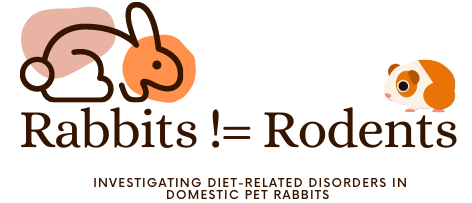

## Udacity-DS-Project-1

 

--- 

This project is the first of four, and part of the Udacity Data Scientist Nanodegree. 

This work aims to follow the CRISP-DM process, exhibit technical skills, and communicate insights by way of a blog post. 

The topic of this project was chosen as a personal interest but also to raise awareness on the health of one of the most popular pets in the UK. 

### Objective: 

Highlighting the impact of an unsuitable diet and poor nutrition on one of the UK's most popular pets.

### Abstract:
To-date pet shops in the UK and world-wide continue to sell inappropriate treats and muesli advertised for rabbits which have a negative effect on their health leading to primary and secondary disorders to include but not limited to, dental disease, obesity, and flystrike. Moreover, many treats and muesli foodstuffs depict rabbits together with rodents including guinea pigs and hamsters despite being of a different order, what they eat and how food is processed in their digestive system. The continued collating of rabbits with rodents to the same dietary requirements causes harm to pet rabbits. 

                                   The tabular dataset can be found in the CSV folder

The data in this project is based on research by O'Neill, D. G. in "Morbidity and Mortality of Domestic Rabbits (Oryctolagus cuniculus) Under Primary Veterinary Care in England in 2013" https://rvc-repository.worktribe.com/output/1382109/morbidity-and-mortality-of-domestic-rabbits-oryctolagus-cuniculus-under-primary-veterinary-care-in-england-in-2013 

 

#### Four questions I am interested in answering:

1. Is there a relationship between rabbit breed, sex, and disorders?
2. Is there a relationship between unneutered-related disorders?
3. What are the most common disorders occurring in rabbits?
4. Which common disorder(s) are related to an improper diet. 

 

The following libraries are used: 

-  Pandas
-  NumPy
-  Matplotlib 
-  Seaborn

